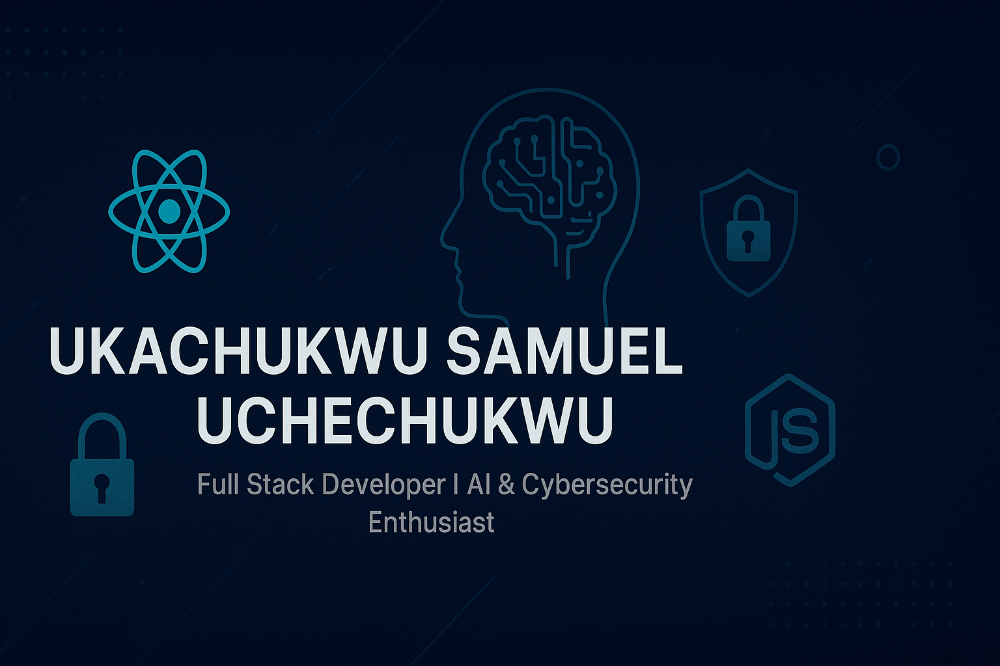

<!-- Banner -->

  

---

# 👋 Hey there, I'm Samuel!

🚀 **Full Stack Developer | AI & Cybersecurity Enthusiast | Ethical Hacking Learner**  
I'm passionate about building secure, scalable, and innovative solutions while exploring new technologies to solve real-world problems.

---

## 💡 About Me
- 🌍 Based in **Owerri, Imo State, Nigeria**
- 🎓 **B.Sc Student at IMSU**
- 💻 Freelance **Full Stack Developer**
- 🤖 Previously worked in **AI Training, Data Analysis, and Data Annotation**
- 🔐 Currently learning **Ethical Hacking** to enhance cybersecurity skills
- 🎥 Also a **Content Creator** on YouTube & TikTok

---

## 🛠 Tech Stack
**Languages & Frameworks:**

  
  
  
  
  
  

**Tools & Platforms:**

  
  
  
  

---

## 🚀 Featured Projects
Here are some of my key projects:

| Project | Description | Tech Stack | Live Demo |
|----------|-------------|------------|-----------|
| **IMSU Bookshop E-commerce** | Full-stack online store for university bookshop. | React, Tailwind, Node.js, MySQL | [Live Demo](https://your-vercel-link.vercel.app) |
| **TizerAutos** | E-commerce platform for car sales. | React, Tailwind, Node.js | [Live Demo](https://your-vercel-link.vercel.app) |
| **Caesar Autos** | Website for auto dealership. | React, Tailwind | [Live Demo](https://your-vercel-link.vercel.app) |
| **Farmer Intelligence System** | Web system for farmers to access tools and insights. | React, Node.js, MySQL | [Live Demo](https://your-vercel-link.vercel.app) |

> *More projects coming soon...*

---

## 📈 GitHub Stats

  
  

---

## 📫 Contact Me
- **Email:** [thunderddg3@gmail.com](mailto:thunderddg3@gmail.com)
- **Phone:** 08063802514
- **GitHub:** [https://github.com/priestooo](https://github.com/priestooo)
- **Portfolio:** [Coming Soon](#)

---

## ⭐ Support My Work
If you like my work, consider **starring** my repositories or sharing them!

  

